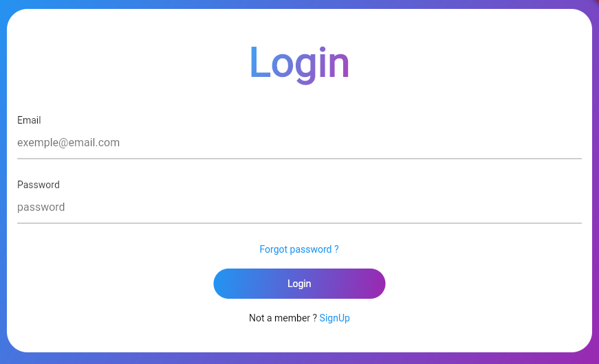
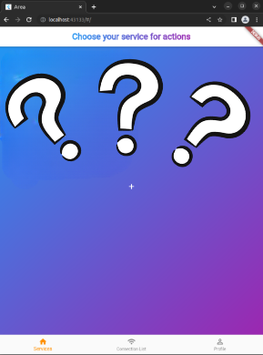
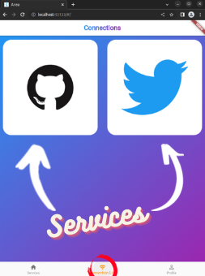
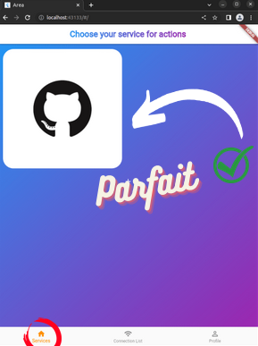
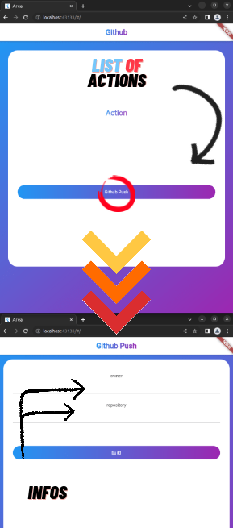
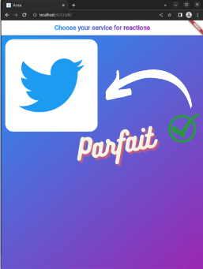



    

# AREA

# Description du projet

Le projet AREA est une application web et mobile permettant l'automatisation de multiple tâches de notifications par messagerie e-mail ou SMS en interconnectant de multiples APIs tel que Discord, Slack, Github ou Gmail.

Trois concepts sont à distinguer

- Les Actions : des évenements importants tel qu'un commit Github ou un post Facebook activent un trigger sur nos serveurs.
- Les REActions : des réponses à ses évenements qui signale l'action sur d'autres plateformes en envoyant un mail ou un message.
- Les services : différents services d'API fournissant des Actions et/ou des REActions à interconnecter.

# Exemple

Je réalise un nouveau commit sur un projet Github (Action), ce push est signalé à toute mon équipe par Mail et/ou sur le serveur Discord de l'équipe (REAction).

# Documentation utilisateur

Lors du lancement du projet AREA, l'utilisateur se retrouvera soit dans l'application mobile ou bien le site internet en fonction de l'appareil qu'il utilise actuellement.
Il se retrouvera par la suite dans le besoin de se connecter pour avoir accès aux différentes fonctionnalités présentes sur ce projet.

Une fois connecté, l'utilisateur arrivera sur la page principale de l'application mobile ou bien du site internet. Cependant, il n'aura accès à aucun service disponible sur le projet car aucun d'entre eux n'est relié au compte.

Et pour remédier à ce problème, il devra cliquer sur "Connection list" pour avoir la possibilité de se connecter sur ces services afin de pouvoir les utiliser pour faire des actions mais également des réactions.

## Services & Actions

Les connexions étant faites, il est maintenant possible de revenir sur la page d'avant en s'apercevant des services précédemment vus.
Prenons par exemple le cas du service Github pour
laquelle une action est disponible d'accès.

Une fois le service sélectionné, l'utilisateur pourra choisir l'action qu'il souhaitera faire avec celui-ci.
Suivant notre exemple, il pourra sélectionner l'action "Github Push".
Dans laquelle il aura les droits de paramétrer ses informations de manière à envoyer ce qu'il souhaitait vouloir faire initialement.

## Services & Réactions

Maintenant, l'utilisateur devra sélection un service dans laquelle il pourra effectuer sa réaction avec l'action qui a déjà été choisie.
Ainsi pour accompagner l'action faite via "Github", "Twitter" sera choisi.

Même chose se produisant pour l'action lors de la sélection de service, une liste de réaction disponible sera affiché pour le service choisi, "Twitter".
Enfin, en prenant ce service, le nom de l'utilisateur ainsi que le message personnalisé est à fournir pour pouvoir effectuer cette réaction.

##

🎉 L'utilisateur a enfin défini son action-réaction qu'il pourra maintenant visualiser dans le dashboard. 🎉

## Connexion aux services externes

## Tokens d'authentification

Vous devrez configurer un compte développeur pour chacune des APIs que vous souhaitez faire fonctionner avec l'AREA. Entrez les informations d'identification dans le fichier docker-compose.yml à la racine du projet.

## Services OAuth2.0

Chacun de ces services dispose d'un système permettant de lier votre compte pour ce service à votre compte dans l'AREA, vous êtes priés de donner toutes les autorisations requises par l'application, le cas échéant certaines fonctionnalités pourraient ne pas être disponibles.

- Google Calendar (via Google)
- YouTube (via Google)
- Gmail (via Google)
- Twitter
- Discord
- Github
